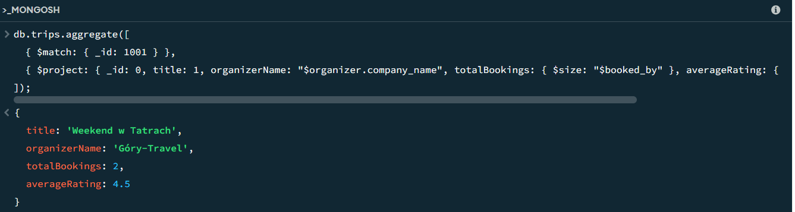
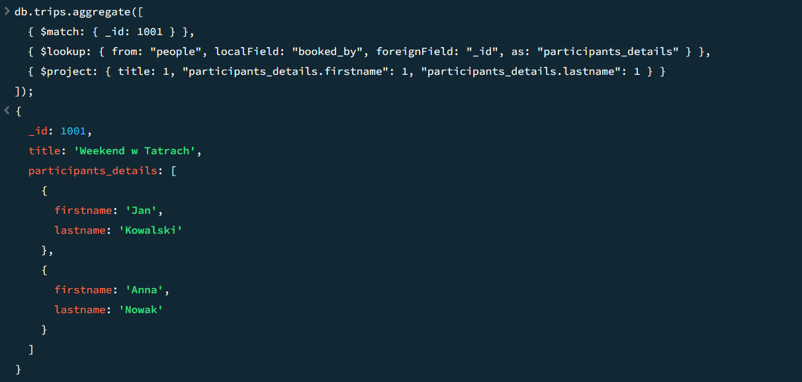
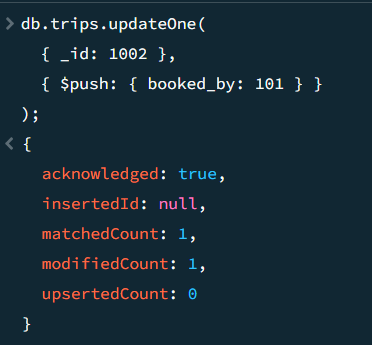

# Dokumentowe bazy danych – MongoDB

Ćwiczenie 2


---

**Imiona i nazwiska autorów:**

--- 

Odtwórz z backupu bazę `north0`

- najprostsza wersja

```
mongorestore dump
```

- to polecenie odtworzy wszystkie bazy danych znajdujące się we wskazanym folderze (w tym przypadku ` dump `) 
	- najłatwiej wgrać tam folder zawierający pliki z backupem i wykonać proste polecenie mongorestore 
- dokumentacja:
	- https://www.mongodb.com/docs/database-tools/mongorestore/

Wybierz bazę north0

Baza `north0` jest kopią relacyjnej bazy danych `Northwind`
- poszczególne kolekcje odpowiadają tabelom w oryginalnej bazie `Northwind`


# Zadanie 0 

zapoznaj się ze strukturą dokumentów w bazie `North0`

```js
db.customers.find()
db.orders.find();
db.orderdetails.find();

```

# Zadanie 1 - operacje wyszukiwania danych,  przetwarzanie dokumentów

# a)

stwórz kolekcję  `OrdersInfo`  zawierającą następujące dane o zamówieniach
- kolekcję  `OrdersInfo` należy stworzyć przekształcając dokumenty w oryginalnych kolekcjach `customers, orders, orderdetails, employees, shippers, products, categories, suppliers` do kolekcji  w której pojedynczy dokument opisuje jedno zamówienie

spodziewany wynik:

```js
[  
  {  
    "_id": ...
    
    OrderID": ... numer zamówienia
    
    "Customer": {  ... podstawowe informacje o kliencie skladającym  
      "CustomerID": ... identyfikator klienta
      "CompanyName": ... nazwa klienta
      "City": ... miasto 
      "Country": ... kraj 
    },  
    
    "Employee": {  ... podstawowe informacje o pracowniku obsługującym zamówienie
      "EmployeeID": ... idntyfikator pracownika 
      "FirstName": ... imie   
      "LastName": ... nazwisko
      "Title": ... stanowisko  
     
    },  
    
    "Dates": {
       "OrderDate": ... data złożenia zamówienia
       "RequiredDate": data wymaganej realizacji
    }

    "Orderdetails": [  ... pozycje/szczegóły zamówienia - tablica takich pozycji 
      {  
        "UnitPrice": ... cena
        "Quantity": ... liczba sprzedanych jednostek towaru
        "Discount": ... zniżka  
        "Value": ... wartośc pozycji zamówienia
        "product": { ... podstawowe informacje o produkcie 
          "ProductID": ... identyfikator produktu  
          "ProductName": ... nazwa produktu 
          "QuantityPerUnit": ... opis/opakowannie
          "CategoryID": ... identyfikator kategorii do której należy produkt
          "CategoryName" ... nazwę tej kategorii
        },  
      },  
      ...   
    ],  

    "Freight": ... opłata za przesyłkę
    "OrderTotal"  ... sumaryczna wartosc sprzedanych produktów

    "Shipment" : {  ... informacja o wysyłce
        "Shipper": { ... podstawowe inf o przewoźniku 
           "ShipperID":  
            "CompanyName":
        }  
        ... inf o odbiorcy przesyłki
        "ShipName": ...
        "ShipAddress": ...
        "ShipCity": ... 
        "ShipCountry": ...
    } 
  } 
]  
```


# b)

stwórz kolekcję  `CustomerInfo`  zawierającą następujące dane każdym kliencie
- pojedynczy dokument opisuje jednego klienta

spodziewany wynik:

```js
[  
  {  
    "_id": ...
    
    "CustomerID": ... identyfikator klienta
    "CompanyName": ... nazwa klienta
    "City": ... miasto 
    "Country": ... kraj 

	"Orders": [ ... tablica zamówień klienta o strukturze takiej jak w punkcie a) 
	                (oczywiście bez informacji o kliencie)
	  
	]

		  
]  
```

# c) 

Napisz polecenie/zapytanie: Dla każdego klienta pokaż wartość zakupionych przez niego produktów z kategorii 'Confections'  w 1997r
- Spróbuj napisać to zapytanie wykorzystując
	- oryginalne kolekcje (`customers, orders, orderdertails, products, categories`)
	- kolekcję `OrderInfo`
	- kolekcję `CustomerInfo`

- porównaj zapytania/polecenia/wyniki

```js
[  
  {  
    "_id": 
    
    "CustomerID": ... identyfikator klienta
    "CompanyName": ... nazwa klienta
	"ConfectionsSale97": ... wartość zakupionych przez niego produktów 
	                         z kategorii 'Confections'  w 1997r

  }		  
]  
```

# d)

Napisz polecenie/zapytanie:  Dla każdego klienta poaje wartość sprzedaży z podziałem na lata i miesiące
Spróbuj napisać to zapytanie wykorzystując
	- oryginalne kolekcje (`customers, orders, orderdertails, products, categories`)
	- kolekcję `OrderInfo`
	- kolekcję `CustomerInfo`

- porównaj zapytania/polecenia/wyniki

```js
[  
  {  
    "_id": 
    
    "CustomerID": ... identyfikator klienta
    "CompanyName": ... nazwa klienta

	"Sale": [ ... tablica zawierająca inf o sprzedazy
	    {
            "Year":  ....
            "Month": ....
            "Total": ...	    
	    }
	    ...
	]
  }		  
]  
```

# e)

Załóżmy że pojawia się nowe zamówienie dla klienta 'ALFKI',  zawierające dwa produkty 'Chai' oraz "Ikura"
- pozostałe pola w zamówieniu (ceny, liczby sztuk prod, inf o przewoźniku itp. możesz uzupełnić wg własnego uznania)
Napisz polecenie które dodaje takie zamówienie do bazy
- aktualizując oryginalne kolekcje `orders`, `orderdetails`
- aktualizując kolekcję `OrderInfo`
- aktualizując kolekcję `CustomerInfo`

Napisz polecenie 
- aktualizując oryginalną kolekcję orderdetails`
- aktualizując kolekcję `OrderInfo`
- aktualizując kolekcję `CustomerInfo`

# f)

Napisz polecenie które modyfikuje zamówienie dodane w pkt e)  zwiększając zniżkę  o 5% (dla każdej pozycji tego zamówienia) 

Napisz polecenie 
- aktualizując oryginalną kolekcję `orderdetails`
- aktualizując kolekcję `OrderInfo`
- aktualizując kolekcję `CustomerInfo`


UWAGA:
W raporcie należy zamieścić kod poleceń oraz uzyskany rezultat, np wynik  polecenia `db.kolekcka.fimd().limit(2)` lub jego fragment


## Zadanie 1  - rozwiązanie

> Wyniki: 
> 
> przykłady, kod, zrzuty ekranów, komentarz ...

a)

```js
--  ...
```

b)


```js
--  ...
```

....

# Zadanie 2 - modelowanie danych


Zaproponuj strukturę bazy danych dla wybranego/przykładowego zagadnienia/problemu

Należy wybrać jedno zagadnienie/problem (A lub B lub C)

Przykład A
- Wykładowcy, przedmioty, studenci, oceny
	- Wykładowcy prowadzą zajęcia z poszczególnych przedmiotów
	- Studenci uczęszczają na zajęcia
	- Wykładowcy wystawiają oceny studentom
	- Studenci oceniają zajęcia

Przykład B
- Firmy, wycieczki, osoby
	- Firmy organizują wycieczki
	- Osoby rezerwują miejsca/wykupują bilety
	- Osoby oceniają wycieczki

Przykład C
- Własny przykład o podobnym stopniu złożoności

a) Zaproponuj  różne warianty struktury bazy danych i dokumentów w poszczególnych kolekcjach oraz przeprowadzić dyskusję każdego wariantu (wskazać wady i zalety każdego z wariantów)
- zdefiniuj schemat/reguły walidacji danych
- wykorzystaj referencje
- dokumenty zagnieżdżone
- tablice

b) Kolekcje należy wypełnić przykładowymi danymi

c) W kontekście zaprezentowania wad/zalet należy zaprezentować kilka przykładów/zapytań/operacji oraz dla których dedykowany jest dany wariant

W sprawozdaniu należy zamieścić przykładowe dokumenty w formacie JSON ( pkt a) i b)), oraz kod zapytań/operacji (pkt c)), wraz z odpowiednim komentarzem opisującym strukturę dokumentów oraz polecenia ilustrujące wykonanie przykładowych operacji na danych

Do sprawozdania należy dołączyć 
- plik z kodem operacji/zapytań w wersji źródłowej (np. plik .js, np. plik .md ) 
- oraz kompletny zrzut wykonanych/przygotowanych baz danych (taki zrzut można wykonać np. za pomocą poleceń `mongoexport`, `mongdump` …)  
	- załącznik ze zrzutem baz powinien mieć format zip

## Zadanie 2  - rozwiązanie


Wybraliśmy przykład B do implementacji

**a)**

W przypadku modelowania bazy dla wycieczek organizowanych przez firmy oraz rezerwowanych i ocenianych przez osoby, możemy rozważyć dwa podejścia:  

**Wariant 1:** Model silnie znormalizowany (Relacyjny)

Struktura: Tworzymy 5 oddzielnych kolekcji: companies (firmy), people (osoby), trips (wycieczki), bookings (rezerwacje), reviews (oceny). Łączymy je wyłącznie za pomocą referencji (np. w kolekcji reviews trzymamy tylko trip_id i person_id).

Zalety: Całkowity brak duplikacji danych. Jeśli firma zmieni nazwę, modyfikujemy to tylko w jednym dokumencie w kolekcji companies.

Wady: Aby pobrać informacje o wycieczce (np. jej nazwę, nazwę firmy organizującej oraz wszystkie oceny), musimy użyć wielu drogich operacji złączeń ($lookup). W MongoDB jest to mało wydajne i nie wykorzystuje pełnego potencjału bazy dokumentowej.

**Wariant 2:** Model hybrydowy (Dokumentowy)

Struktura: Tworzymy tylko 3 kolekcje: companies, people oraz centralną kolekcję trips. W kolekcji trips przechowujemy podstawowe referencje, ale też stosujemy tablice i dokumenty zagnieżdżone.  

Wykorzystanie mechanizmów:  

Dokumenty zagnieżdżone (embedded documents): Podstawowe dane organizatora (id oraz nazwa firmy) są zagnieżdżone bezpośrednio w dokumencie wycieczki.

Tablice (arrays): Oceny (reviews) to tablica zagnieżdżonych obiektów wewnątrz wycieczki.

Referencje: Rezerwacje to tablica referencji (identyfikatorów) do klientów z kolekcji people.

Zalety: Błyskawiczny odczyt. Większość kluczowych informacji o wycieczce pobieramy pojedynczym zapytaniem (bez $lookup), co idealnie pasuje do architektury aplikacji wyświetlającej oferty.

Wady: Denormalizacja – jeśli firma zmieni nazwę, trzeba ją zaktualizować nie tylko w companies, ale też we wszystkich zagnieżdżonych dokumentach w trips.


**Schemat i reguły walidacji danych (dla kolekcji trips)**

Przed dodaniem danych, definiujemy reguły walidacji ($jsonSchema) dla kolekcji docelowej.

``` js
  db.createCollection("trips", {
   validator: {
      $jsonSchema: {
         bsonType: "object",
         required: [ "title", "price", "organizer" ],
         properties: {
            title: {
               bsonType: "string",
               description: "Tytuł wycieczki - wymagany ciąg znaków"
            },
            price: {
               bsonType: "number",
               minimum: 0,
               description: "Cena - wymagana liczba dodatnia"
            },
            organizer: {
               bsonType: "object",
               required: [ "company_id", "company_name" ],
               description: "Dokument zagnieżdżony - dane firmy organizującej"
            },
            booked_by: {
               bsonType: "array",
               items: { bsonType: "int" },
               description: "Tablica referencji - lista ID osób, które wykupiły bilety"
            },
            reviews: {
               bsonType: "array",
               description: "Tablica zagnieżdżonych dokumentów - oceny wycieczki"
            }
         }
      }
   }
});
```

**b)**

Wypełniamy kolekcje słownikowe (companies, people) oraz główną kolekcję (trips) z wykorzystaniem wymogów strukturalnych (referencje, zagnieżdżenia, tablice).

``` js

// 1. Dodawanie firm organizujących wycieczki
db.companies.insertMany([
  { _id: 1, name: "Góry-Travel", contact: "kontakt@gory-travel.pl" },
  { _id: 2, name: "Morze-Adventures", contact: "biuro@morze.pl" }
]);

// 2. Dodawanie osób (klientów)
db.people.insertMany([
  { _id: 101, firstname: "Jan", lastname: "Kowalski", email: "jan@example.com" },
  { _id: 102, firstname: "Anna", lastname: "Nowak", email: "anna@example.com" },
  { _id: 103, firstname: "Piotr", lastname: "Zalewski", email: "piotr@example.com" }
]);

// 3. Dodawanie wycieczek
db.trips.insertMany([
  {
    _id: 1001,
    title: "Weekend w Tatrach",
    price: 450,
    organizer: { 
      company_id: 1, 
      company_name: "Góry-Travel" 
    },
    booked_by: [101, 102],
    reviews: [
      { person_id: 101, rating: 5, comment: "Świetna wycieczka, polecam!" },
      { person_id: 102, rating: 4, comment: "Pogoda nie dopisała, ale organizacja super." }
    ]
  },
  {
    _id: 1002,
    title: "Rejs po Bałtyku",
    price: 1200,
    organizer: { 
      company_id: 2, 
      company_name: "Morze-Adventures" 
    },
    booked_by: [103],
    reviews: []
  }
]);

```


**c)**

Przykład 1: Bardzo szybki odczyt strony wycieczki (ZALETA)
Ten typ zapytania jest bardzo wydajny, ponieważ dzięki dokumentom zagnieżdżonym i tablicom pobieramy wszystkie szczegóły oferty, organizatora i opinie bez użycia złożonych operacji łączenia relacji.

``` js 
  db.trips.aggregate([
  { $match: { _id: 1001 } },
  { $project: {
      _id: 0,
      title: 1,
      organizerName: "$organizer.company_name",
      totalBookings: { $size: "$booked_by" },
      averageRating: { $avg: "$reviews.rating" }
    }
  }
]);
```

Przykład 2: Pobranie pełnych danych osób, które zarezerwowały wycieczkę (WADA/TRUDNOŚĆ)  
  

Ponieważ przechowujemy tylko referencje (id uczestników), aby pobrać ich pełne nazwiska, musimy użyć operatora $lookup, co pokazuje, że pewne elementy relacyjne nadal istnieją w modelu dokumentowym.

``` js

  db.trips.aggregate([
  { $match: { _id: 1001 } },
  { $lookup: {
      from: "people",
      localField: "booked_by",
      foreignField: "_id",
      as: "participants_details"
    }
  },
  { $project: {
      title: 1,
      "participants_details.firstname": 1,
      "participants_details.lastname": 1
    }
  }
]);

```

Przykład 3: Dodanie nowej rezerwacji miejsca (ZALETA)
Dodanie klienta do wycieczki sprowadza się do prostej operacji na tablicy ($push).

``` js 

  db.trips.updateOne(
  { _id: 1002 },
  { $push: { booked_by: 101 } }
);

```

**TESTY**

Test 1:

``` js

  db.trips.aggregate([
  { $match: { _id: 1001 } },
  { $project: { _id: 0, title: 1, organizerName: "$organizer.company_name", totalBookings: { $size: "$booked_by" }, averageRating: { $avg: "$reviews.rating" } } }
]);

```




Test 2:

``` js 

  db.trips.aggregate([
  { $match: { _id: 1001 } },
  { $lookup: { from: "people", localField: "booked_by", foreignField: "_id", as: "participants_details" } },
  { $project: { title: 1, "participants_details.firstname": 1, "participants_details.lastname": 1 } }
]);

```




Test 3:

``` js

  db.trips.updateOne(
  { _id: 1002 },
  { $push: { booked_by: 101 } }
);

```

