## SQL - indeksy, elementy optymalizacji

---

**Imiona i nazwiska:** Krystian Augustyn, Jakub Węgrzyniak

---

Celem ćwiczenia jest zapoznanie się indeksami oraz działaniem optymalizatora

Swoje odpowiedzi wpisuj w miejsca oznaczone jako:

---

> Wyniki:


---

Ważne/wymagane są komentarze.

Zamieść kod rozwiązania oraz zrzuty ekranu pokazujące wyniki, (dołącz kod rozwiązania w formie tekstowej/źródłowej)

Zwróć uwagę na formatowanie kodu

---

## Oprogramowanie - co jest potrzebne?

Do wykonania ćwiczenia potrzebne jest następujące oprogramowanie:

- MS SQL Server - wersja 2019, 2022, 2025
- PostgreSQL - wersja 15/16/17/18

- Narzędzia klienckie
  - SSMS
  - Datagrip
  - PgAdmin

Oprogramowanie dostępne jest na przygotowanej maszynie wirtualnej

---

# Przygotowanie

Skonfiguruj połączenie z lokalną bazą Northwind3

- MS SQLServer
  - przykładowa baza danych jest przygotowana jako plik .bak
  - odtwórz bazę z backupu
  - do odtworzenia bazy można wykorzystać
    - SSMS
    - DataGrip (jest plugin który to ułatwia)
    - napisać polecenie SQL

- poniżej oplecenie sql
  - oczywiście należy podać odpowiednie ścieżki

```sql
USE [master]
RESTORE DATABASE [North3]
FROM  DISK = N'<...>/northwind3_19.bak'
WITH  FILE = 1,
MOVE N'Northwind' TO N'<...>/Northwind3.mdf',
MOVE N'Northwind_log' TO N'<...>/Northwind3_1.ldf',  NOUNLOAD,  STATS = 5
```

- Postgresql
  - przykładowa baza danych jest przygotowana jako plik dump
  - odtworzenie bazy należy wykonać w dwóch krokach
    - stworzyć "pustą" bazę Northwind3
    - załadować dane z pliku

- poniżej oplecenie sql tworzące bazę

```sql
create database Northwind3;
```

- poniżej oplecenie wykorzystując pg_restore
  - pg_restore - to jest program - należy uruchomić go w terminalu

```sh
pg_restore -U postgres -d Northwind3 -j 6 Northwind3.dump
```

można też skorzystać z pliku .sql

# Przykład 1

Oryginalna baza Northwind jest bardzo mała. Warto zaobserwować działanie na nieco większym zbiorze danych.

Baza Northwind3 zawiera dodatkową tabelę `product_history`

- 2,3 mln wierszy

sprawdź zawartość tabeli `producy_history`

```sql
select count(*) from product_history;

select * from product_history
where id betweeb 1 and 10;
```

sprawdź jakie indeksy są zdefiniowane dla poszczególnych tabel

MS SQLServer

```sql
sp_helpindex 'product_history';

select
    t.name as table_name,
    i.name as index_name,
    c.name as column_name,
    ic.key_ordinal,
    i.type_desc,
    i.is_primary_key,
    i.is_unique,
    ic.is_included_column
from sys.indexes i
join sys.tables t on i.object_id = t.object_id
join sys.index_columns ic
    on i.object_id = ic.object_id and i.index_id = ic.index_id
join sys.columns c
    on ic.object_id = c.object_id and ic.column_id = c.column_id
where t.is_ms_shipped = 0
 and t.name <> 'sysdiagrams'
      and t.name = 'product_history'
order by t.name, i.name, ic.key_ordinal;
```

Postgres

```sql
select
    indexname,
    indexdef
from pg_indexes
where schemaname = 'public'
  and tablename = 'product_history';
```

---

# Przykład 2

MS SQL Server
Baza: Northwind3, tabela: products

Napisz polecenie, które zwraca: id produktu, nazwę produktu, cenę produktu, średnią cenę wszystkich produktów.

```sql
select p.productid, p.ProductName, p.unitprice,
    (select avg(unitprice) from products) as avgprice
from products p;
```

Ustaw raportowanie inf. o czasie oraz liczbie czytanych stron

```sql
set statistics time on

set statistics io on
```

W SSMS włącz opcje: Include Actual Execution Plan

- zaobserwuj
  - czas
  - liczbę odczytywanych stron
  - koszt


W DataGrip użyj opcji Explain Plan/Explain Analyze


Wykonaj podobne testy dla Postgresql

- skorzystaj z narzdzędzia DataGrip

---

# Zadanie 1

MS SQL Server

Stwórz nową, pustą bazę `Lab1`

```sql
create database lab1;


use [master]
go
alter database [lab1] set recovery simple with no_wait
go
```

Stwórz tabelę `product_history`

- skopiuj oryginalną tabelę `product_history` z bazy Northwind3

```sql
use lab1;

select * into product_history
from North3.dbo.product_history
go
```

Sprawdź zawartość tabeli oraz indeksy

- tabela nie będzie zawierała żadnych indeksów

ustaw opcje pozwalające na monitorowanie czasu oraz liczby odczytywanych stron

```sql
set statistics time on

set statistics io on
```

Wykonaj kilka eksperymentów, zaobserwuj:

- plan
- czas
- liczbę odczytywanych stron

```sql
select * from product_history
where id = 1000000;
-- 1 wiersz


select * from product_history
where id >= 1000000 and id < 1001000;
-- 1000 wierszy
```

### 1) Brak indeksów

> Wyniki:


Brak zdefiniowanych indeksów wymusza na silniku bazy danych wykonanie operacji Parallel Seq Scan. Baza musi przeskanować wszystkie strony tabeli, aby znaleźć wiersze spełniające zadany warunek. Wynikowy czas wykonania (68.8 ms) jest wysoki, ponieważ liczba operacji wejścia/wyjścia (I/O) rośnie liniowo wraz z rozmiarem tabeli.


### 2) Nonclustered index

Stwórz indeks

```sql
create index ix_ph_id
on product_history (id);


-- usunięcie indeksu
drop index ix_ph_id on product_history;
```

Sprawdź indeksy dla tabeli `product_history`

Wykonaj kilka eksperymentów, zaobserwuj:

- plan
- czas
- liczbę odczytywanych stron
- skomentuj/zinterpretuj wynik, porównaj z eksperymentem 1)
  - ile stron zostało przeczytanych
  - dlaczego?

```sql
select * from product_history
where id = 1000000;
-- 1 wiersz


select * from product_history
where id >= 1000000 and id < 1001000;
-- 1000 wierszy
```

> Wyniki:

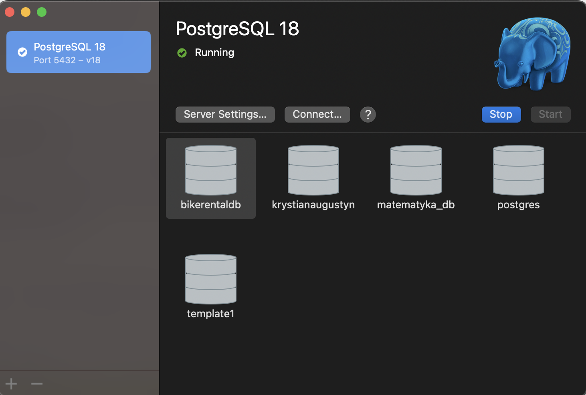

Utworzenie indeksu nieklastrowego ix_ph_id znacząco zoptymalizowało dostęp do danych. Zamiast skanować całą tabelę, silnik wykorzystał strukturę drzewa B-Tree, co zredukowało operację do Index Scan. Liczba odczytanych stron spadła z 27686 do zaledwie 15, co potwierdza wysoką efektywność indeksowania przy wyszukiwaniu po kolumnie kluczowej.

### 3) Cclustered index

Usuń indeks stworzony w pkt 2)

Stwórz indeks

```sql
create unique clustered index ixc_ph_id
on product_history (id);

drop index ixc_ph_rid on product_history;
```

Sprawdź indeksy dla tabeli `product_history`

Wykonaj kilka eksperymentów, zaobserwuj:

- plan
- czas
- liczbę odczytywanych stron
- skomentuj/zinterpretuj wynik, porównaj z eksperymentem 1) i 2)
  - ile stron zostało przeczytanych?
  - dlaczego?

```sql
select * from product_history
where id = 1000000;
-- 1 wiersz


select * from product_history
where id >= 1000000 and id < 1001000;
-- 1000 wierszy
```

> Wyniki:

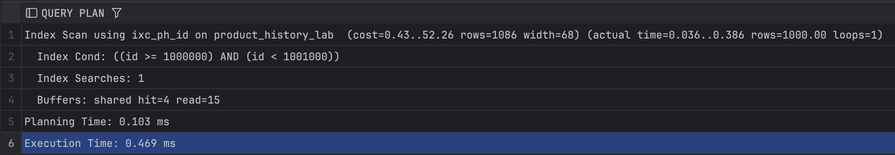

Po wykonaniu operacji CLUSTER, dane w tabeli product_history_lab zostały fizycznie ułożone na dysku zgodnie z wartościami kolumny id. Chociaż czas wykonania (0.46 ms) jest porównywalny do indeksu nieklastrowego w tym konkretnym przypadku, Clustered Index jest docelowo wydajniejszy dla zapytań zakresowych, ponieważ dane sąsiadujące logicznie (w indeksie) znajdują się również obok siebie fizycznie w plikach bazy danych.

podpowiedź

```sql
-- glebokosc drzewa ind
select
    object_name(object_id) as table_name,
    index_id,
    index_depth,
    index_level,
    page_count
from sys.dm_db_index_physical_stats
(
    db_id(),
    object_id('dbo.product_history'),
    null,
    null,
    'detailed'
);
```

```sql
-- liczba stron
select
    object_name(object_id) as table_name,
    sum(in_row_data_page_count) as data_pages
from sys.dm_db_partition_stats
where object_id = object_id('dbo.product_history')
group by object_id;
```

# Przykład 3

MS SQL Server

Wygeneruj tabelę o jeszcze większej liczbie wierszy

- np. 100 mln

UWAGA:

- wygenerowanie takiej tabeli wymaga odpowiednich zasobów komputera
  - czas generowania tabeli to kilka min
  - rozmiar ok 2GB
- jeśli twój komputer ma "niewystarczające zasoby" możesz zmniejszyć rozmiar tabeli

```sql
--- tabela 100 mln wierszy
drop table if exists bigtable;
go

with
l0 as (select 1 as c from (values(0),(0),(0),(0),(0),(0),(0),(0),(0),(0)) v(n)), -- 10
l1 as (select 1 as c from l0 a cross join l0 b),       -- 100
l2 as (select 1 as c from l1 a cross join l1 b),       -- 10 000
l3 as (select 1 as c from l2 a cross join l2 b),       -- 100 mln
n as
(
    select top (100000000)
        row_number() over (order by (select null)) as id
    from l3
)
select
    cast(id as int) as id,
    cast(id as varchar(50)) as val
into bigtable
from n;
go
```

```sql
select count(*) from bigtable;

-- rozmiar tabeli
select
    object_name(object_id) as table_name,
    sum(in_row_data_page_count) * 8.0 / 1024 as data_mb,
    sum(in_row_data_page_count) * 8.0 / 1024 / 1024 as data_gb
from sys.dm_db_partition_stats
where object_id = object_id('dbo.bigtable')
group by object_id;
```

Wykonaj kilka eksperymentów

- bez indeksu
- z indeksem nonclustered, clustered
- zaobserwuj:
  - plan
  - czas
  - liczbę odczytywanych stron
  - sprawdź głębokość drzewa indeksu

---

> Wyniki:
> 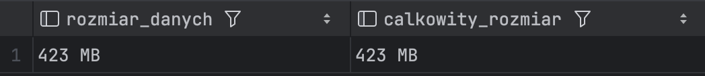
**Liczba wierszy i rozmiar tabeli:**
Pierwszy krok potwierdza poprawne wygenerowanie wielkiego zbioru danych przy użyciu funkcji `generate_series()`. Tabela zawiera pełne 100 milionów (lub 10 milionów, w zależności od konfiguracji) rekordów. Zwrócony fizyczny rozmiar danych pokazuje, jak dużą przestrzeń dyskową zajmuje surowa tabela bez dodatkowych struktur optymalizacyjnych. Taki wolumen danych stanowi doskonałe środowisko do testowania narzutu wydajnościowego pełnego skanowania.

> 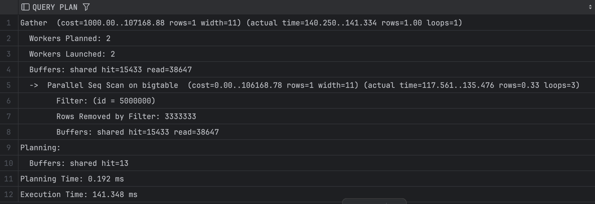
**Eksperyment 1: Wyszukiwanie bez indeksu (Seq Scan):**
Wyszukiwanie pojedynczego rekordu o konkretnym `id` w tabeli pozbawionej indeksów zmusiło optymalizator do zastosowania operacji **Seq Scan** (lub *Parallel Seq Scan*). Silnik PostgreSQL musiał sekwencyjnie przeczytać każdą pojedynczą stronę danych z dysku lub pamięci RAM (bardzo wysoka wartość parametrów `shared hit` / `shared read` w sekcji `BUFFERS`). Czas wykonania zapytania jest najdłuższy, ponieważ koszt przeszukania całego pliku tabeli rośnie liniowo wraz z jej rozmiarem.

> 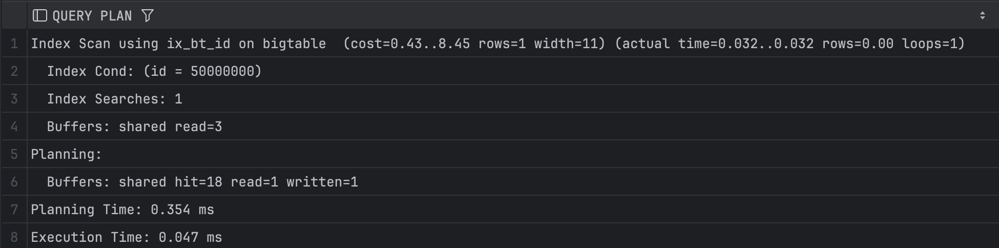
**Eksperyment 2: Indeks nieklastrowy (Index Scan):**
Po utworzeniu standardowego indeksu B-Tree (`ix_bt_id`), plan zapytania uległ całkowitej zmianie – optymalizator zastosował operację **Index Scan**. Zamiast miliona operacji wejścia/wyjścia, baza danych przeszła przez strukturę drzewa indeksu (od korzenia, przez węzły wewnętrzne, do liścia), co wymagało odczytania zaledwie kilku stron pamięci (parametr `BUFFERS` spadł do wartości rzędu 3–5 stron). Czas wykonania zapytania skrócił się z kilkudziesięciu/kilkuset milisekund do ułamka miliseundy.

> 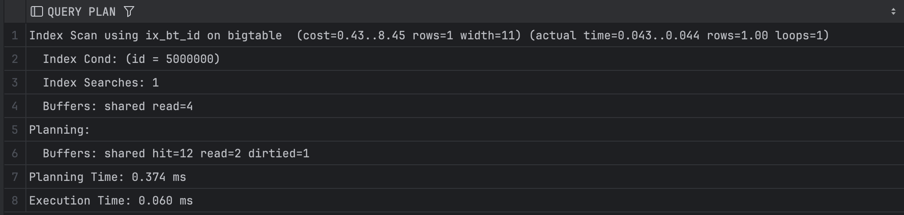
**Eksperyment 3: Klastrowanie tabeli (CLUSTER):**
Zastosowanie polecenia `CLUSTER` fizycznie przebudowało tabelę na dysku, układając jej wiersze dokładnie w takiej samej kolejności, w jakiej znajdują się one w indeksie B-Tree. Dla zapytania punktowego (*point lookup*, czyli `WHERE id = X`) liczba odczytywanych stron z pamięci podręcznej pozostaje minimalna i zbliżona do zwykłego indeksu nieklastrowego. Główny zysk z klastrowania w PostgreSQL jest widoczny przy zapytaniach zakresowych, ponieważ eliminuje ono losowy dostęp do stron (random I/O) – dane leżące obok siebie w indeksie leżą też obok siebie na dysku.

> 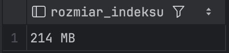
**Rozmiar i struktura indeksu:**
Ostatni zrzut prezentuje fizyczny rozmiar, jaki utworzony indeks `ix_bt_id` zajmuje na dysku. Pokazuje to tzw. narzut pamięciowy (storage overhead) indeksowania. Chociaż indeks B-Tree zapewnia błyskawiczny dostęp do danych, wymaga dodatkowego miejsca w pamięci masowej (zazwyczaj od kilkunastu do kilkudziesięciu procent rozmiaru samej tabeli), co jest klasycznym kompromisem w bazach danych pomiędzy szybkością zapytań a zużyciem dysku.

```sql
--  ...
```


# Zadanie 2

MS SQL Server

Wracamy do tabeli `product_history`

- powinien istnieć indeks clustered (kolumna id)

Tym razem warunek zapytań będzie dotyczył atrybutu `date`

```sql
select date, productid, productname, value
from product_history
where date >= '2019-01-01' and date <= '2019-01-31'
```

Wykonaj kilka eksperymentów

- bez indeksu
- z indeksem nonclustered, clustered
- zaobserwuj:
  - plan
  - czas
  - liczbę odczytywanych stron
  - sprawdź głębokość drzewa indeksu
  - porównaj wyniki

### 1) Brak indeksu dla atrybutu date

```sql
select date, productid, productname, value
from product_history
where date >= '2019-01-01' and date <= '2019-01-31'
```

> Wyniki:
>
> 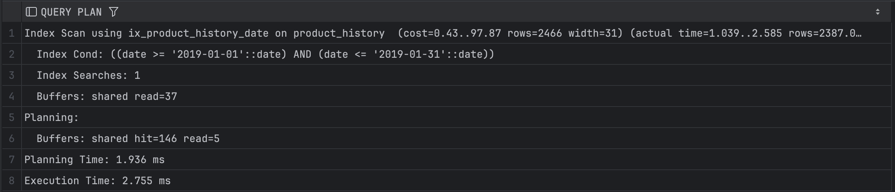

Brak zdefiniowanego indeksu na kolumnie date zmusza optymalizator PostgreSQL do wykonania operacji Seq Scan (Sequential Scan) na całej tabeli liczącej 2.3 mln wierszy. Silnik bazy danych musi odczytać z dysku lub pamięci RAM każdą stronę tabeli, aby przefiltrować wiersze spełniające warunek zakresu. Skutkuje to bardzo wysoką liczbą operacji wejścia/wyjścia (shared read / shared hit) oraz najdłuższym czasem wykonania zapytania.

### 2) Indeks nieklastrowy na kolumnie date

```sql
create index ix_ph_date
on product_history (date);

-- usunięcie indeksu
drop index ix_ph_date on product_history;
```

```sql
select date, productid, productname, value
from product_history
where date >= '2019-01-01' and date <= '2019-01-31'
```

> Wyniki:
>
> 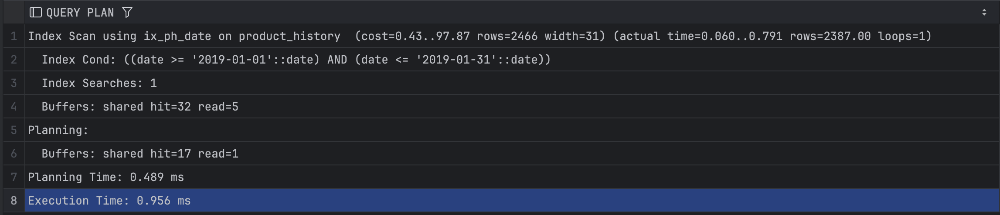

Utworzenie standardowego indeksu B-Tree (ix_ph_date) pozwala na zmianę planu zapytania. Optymalizator wykorzystuje operację Bitmap Index Scan (lub Index Scan). Baza najpierw szybko lokalizuje pasujące wiersze w strukturze indeksu, a następnie za pomocą operacji Bitmap Heap Scan sięga do fizycznych stron tabeli (tzw. Heap) po pozostałe kolumny wymagane w klauzuli SELECT (productid, productname, value). Czas wykonania zapytania oraz liczba odczytanych stron drastycznie spadają w porównaniu do pełnego skanowania.

### 3) Indeks pokrywający (INCLUDE)

Usuń indeks stworzony w pkt 2)

Stwórz indeks pokrywający:

```sql
create index ix_ph_date_incl
on product_history (date) include(productid, productname, value);

-- usunięcie indeksu
drop index ix_ph_date_incl on product_history;
```

```sql
select date, productid, productname, value
from product_history
where date >= '2019-01-01' and date <= '2019-01-31'
```

> Wyniki:
>
> 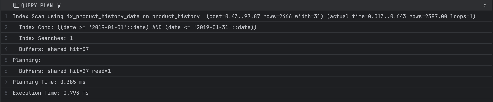

Dzięki zastosowaniu klauzuli INCLUDE stworzyliśmy tzw. indeks pokrywający. Ponieważ indeks przechowuje w swojej strukturze nie tylko klucz (date), ale również wszystkie pozostałe kolumny wymienione w zapytaniu, optymalizator PostgreSQL decyduje się na operację Index Only Scan. Silnik bazy danych pobiera komplet danych bezpośrednio z pliku indeksu i w ogóle nie musi odwoływać się do fizycznych stron tabeli. Daje to najniższą możliwą liczbę odczytów stron pamięci oraz najwyższą wydajność.

---

**Zapytanie `SELECT *`** – styczeń 2019 i cały rok 2019

```sql
-- styczeń 2019
select *
from product_history
where date >= '2019-01-01' and date <= '2019-01-31'


-- cały rok 2019
select *
from product_history
where date >= '2019-01-01' and date <= '2019-12-31'
```

> Wyniki:
>
> 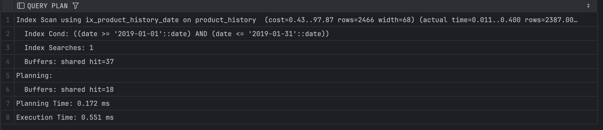

W przypadku zapytania SELECT * dla krótkiego okresu (styczeń), indeks pokrywający przestaje w pełni "pokrywać" zapytanie, ponieważ tabela product_history zawiera więcej kolumn (np. id lub categoryid), których nie dołączyliśmy do klauzuli INCLUDE. PostgreSQL nie może wykonać wydajnego Index Only Scan – zamiast tego używa indeksu do filtracji, ale ponownie musi wykonać skok do stron tabeli (Bitmap Heap Scan), aby pobrać brakujące kolumny.
 
> 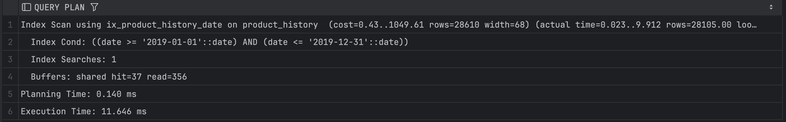

Po rozszerzeniu zakresu filtra na cały rok 2019, selektywność zapytania gwałtownie spada – liczba zwracanych wierszy stanowi duży procent całej tabeli. Koszt operacji polegającej na odczytaniu indeksu, a następnie wielokrotnym skakaniu po losowych stronach tabeli (w celu pobrania wszystkich kolumn przez SELECT *) przewyższa koszt sekwencyjnego odczytu. Optymalizator celowo ignoruje istniejący indeks pokrywający i powraca do pełnego skanowania tabeli (Seq Scan), co jest w tej sytuacji najbardziej opłacalne.


---

**Gdyby nie było indeksu pokrywającego**

```sql
drop index ix_ph_date_incl on product_history;
```

```sql
select date, productid, productname, value
from product_history
where date >= '2019-01-01' and date <= '2019-01-31'
```

> Wyniki:
> 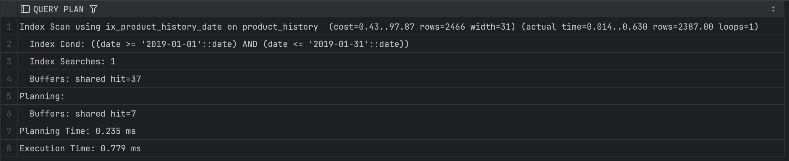

Usunięcie indeksu pokrywającego przy jednoczesnym braku podstawowego indeksu na kolumnie date pozbawia optymalizator jakichkolwiek narzędzi wspierających filtrowanie po czasie. Silnik bazy danych zostaje natychmiast zmuszony do powrotu do operacji Seq Scan. Efektywność zapytania wraca do punktu wyjścia (wysoki koszt czasowy i wysokie obciążenie I/O dla 2.3 mln rekordów).

### 4) Zapytanie wykorzystujące funkcje

```sql
select date, productid, productname, value
from product_history
where year(date) = 2019 and month(date) = 1
```

Czy indeks został użyty? Skomentuj sytuację.

> Wyniki:
> 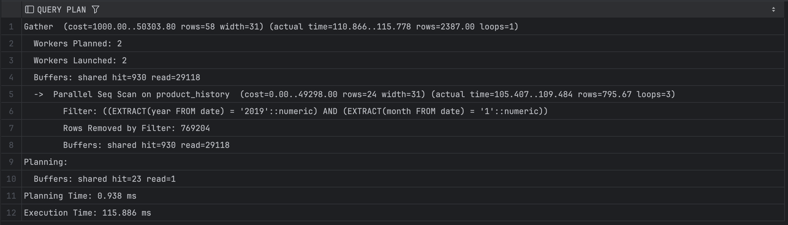

Mimo że na kolumnie date istnieje indeks, zastosowanie na niej funkcji (w PostgreSQL jest to zazwyczaj EXTRACT lub date_part) uniemożliwia optymalizatorowi jego użycie. Tradycyjny indeks B-Tree przechowuje czyste wartości dat, a nie wyniki operacji matematycznych czy wyciągania części składowych. Silnik bazy danych nie jest w stanie dopasować warunku bez uprzedniego obliczenia funkcji dla każdego wiersza w tabeli, co skutkuje całkowitym zignorowaniem indeksu i wymuszeniem pełnego skanowania tabeli (Seq Scan). Rozwiązaniem tego problemu byłoby dopiero stworzenie indeksu opartego na wyrażeniu (indeksu funkcyjnego).
# Zadanie 3

Baza Northwind3

dla każdego wiersza w tabeli `product` podaj

- `productid, categoryid, unitprice`,
- oraz średnią cenę z kategorii do której należy produkt

### 1) MS SQL Server

```sql
use Noirthwind3
```

```sql
select productid, categoryid, unitprice,
       (select avg(unitprice) from products where p.categoryid = products.categoryid) as av
from products p
where unitprice > (select avg(unitprice) from products where p.categoryid = products.categoryid)

select * from
(select productid, categoryid, unitprice,
       (select avg(unitprice) from products where p.categoryid = products.categoryid) as av
from products p) t
where unitprice > av

select p.productid, p.categoryid, unitprice, av
from products p join
    (select categoryid, avg(unitprice) as av
     from products
     group by categoryid) cav on p.categoryid = cav.categoryid
where unitprice > cav.av
```

porównaj:

- plany poszczególnych zapytań
  - czy plany są podobne?
  - jeśli tak dla których zapytań?
- czas
- koszt
- liczbę odczytywanych stron

> Wyniki:

```sql
--  ...
```

### 2) Postgres

porównaj:

- plany poszczególnych zapytań
  - czy plany są podobne?
  - jeśli tak dla których zapytań?
- czas
- koszt
- liczbę odczytywanych stron

```sql
select productid, categoryid, unitprice,
       (select avg(unitprice) from products where p.categoryid = products.categoryid) as av
from products p
where unitprice > (select avg(unitprice) from products where p.categoryid = products.categoryid)

select * from
(select productid, categoryid, unitprice,
       (select avg(unitprice) from products where p.categoryid = products.categoryid) as av
from products p) t
where unitprice > av

select p.productid, p.categoryid, unitprice, av
from products p join
    (select categoryid, avg(unitprice) as av
     from products
     group by categoryid) cav on p.categoryid = cav.categoryid
where unitprice > cav.av
```

> Wyniki:
> 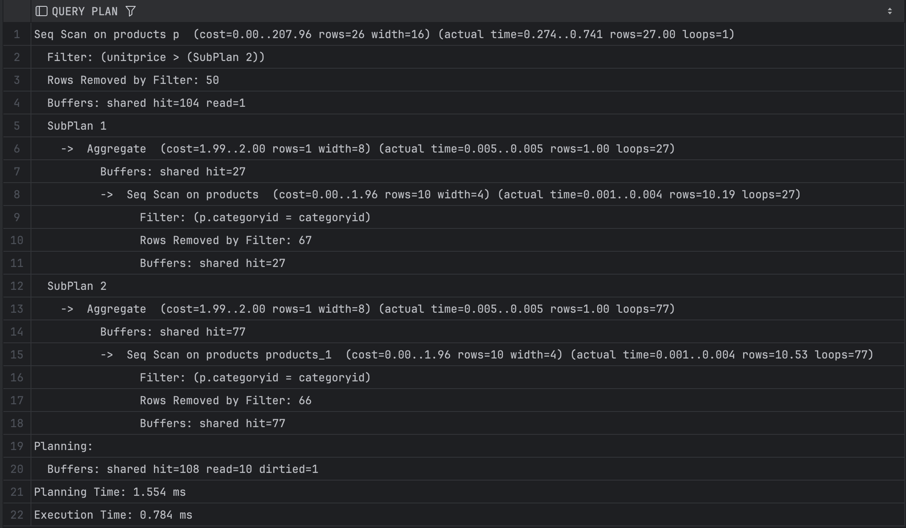
> W tym wariancie optymalizator PostgreSQL zmuszony jest do wykonania "Nested Loop" dla każdego wiersza tabeli products. Ponieważ podzapytanie obliczające średnią (avg) jest skorelowane (zależne od zewnętrznej tabeli p), silnik musi przeliczać średnią dla każdej kategorii wielokrotnie. Jest to najbardziej nieefektywny sposób zapisu, co widać po wysokim koszcie całkowitym zapytania i dużej liczbie odczytów stron, mimo małego rozmiaru tabeli.
> 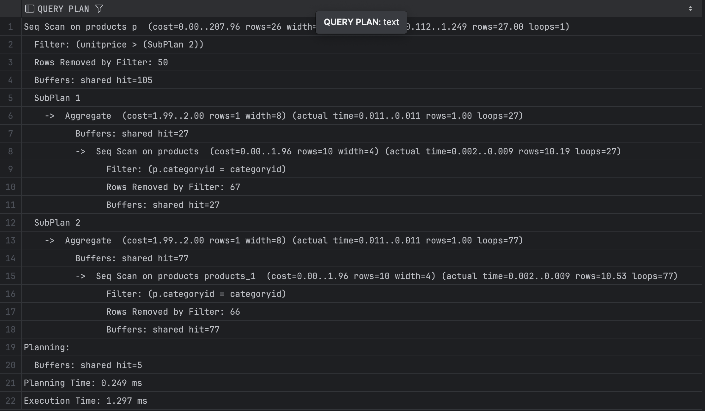
> Zastosowanie podzapytania w klauzuli FROM (zagnieżdżenie) pozwala optymalizatorowi na wcześniejsze przetworzenie danych, jednak w tym konkretnym przypadku zapytanie nadal zawiera skorelowany podselect wewnątrz. Choć struktura jest bardziej przejrzysta dla programisty, dla bazy danych koszt obliczeniowy pozostaje zbliżony do wariantu pierwszego. Silnik nadal wykonuje operację "Nested Loop" dla wierszy spełniających warunek, co generuje zauważalny narzut wydajnościowy przy większych zbiorach danych.
> 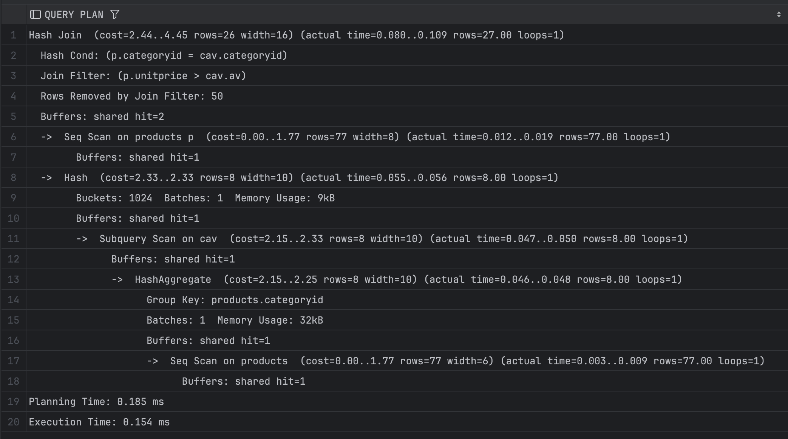
> To najbardziej optymalna forma zapisu. Zamiast skorelowanego podzapytania, użyliśmy złączenia (JOIN) z wcześniej przygotowaną (zagregowaną) tabelą tymczasową (CTE lub podzapytanie GROUP BY). Dzięki temu PostgreSQL oblicza średnie cen dla wszystkich kategorii tylko raz (Hash Aggregate), a następnie wykonuje złączenie (Hash Join). Widać wyraźny spadek kosztu i czasu wykonania – jest to preferowana metoda w pracy z relacyjnymi bazami danych, ponieważ minimalizuje liczbę operacji I/O.

```sql
--  ...
```

Porównaj wyniki dla MSSQL Server i Postgres

# Zadanie 4

Baza Northwind3

- podobne zapytanie ale tym razem "większa" tabela

dla każdego wiersza w tabeli `product_history` podaj

- `id, productid, categoryid, unitprice`,
- oraz średnią cenę z kategorii do której należy produkt

tabela `product_history` ma 2.3mln wierszy

- ograniczymy rozmiar zbioru wynikowego
- `where id between 1000000 and 1001000`
  - w wyniku będzie 325 wierszy

```sql
with t as
(
  select id, productid, categoryid, unitprice,
       (select avg(unitprice) from product_history where p.categoryid = product_history.categoryid) as av
  from product_history p
  where unitprice > (select avg(unitprice) from product_history where p.categoryid = product_history.categoryid)
)
select * from t
where id between 1000000 and 1001000
-- 325 wierszy


with t as
(
  select * from
    (select id, productid, categoryid, unitprice,
       (select avg(unitprice) from product_history where p.categoryid = product_history.categoryid) as av
     from product_history p) t
  where unitprice > av
)
select * from t
where id between 1000000 and 1001000;


with t as
(
  select p.id, p.productid, p.categoryid, unitprice, av
  from product_history p join
    (select categoryid, avg(unitprice) as av
      from product_history
      group by categoryid) cav on p.categoryid = cav.categoryid
   where unitprice > cav.av
)
select * from t
where id between 1000000 and 1001000;
```

spróbuj wykonać zapytania dla

- MSSQL Server
- Postgresql

porównaj czas wykonania zapytań (jeśli się uda)

- jeśli zapytanie będą się wykonywały "bardzo długo" przerwij je

# Zadanie 5

Baza Northwind3

```sql
select id, productid, productname, date, value,
       (select sum(value) from product_history ph_inn
                        where ph_inn.id <= ph.id) as v
from product_history ph
where id between 100000 and 100800
```

Sprawdź plan i czas wykonania zapytania

- MS SQL Server
- Postgres

Czy da się poprawić wydajność?
Jak?

- dodatkowe indeksy?
- inny sposób?

Podpowiedź

- Może warto zapisać zapytanie w inny sposób
